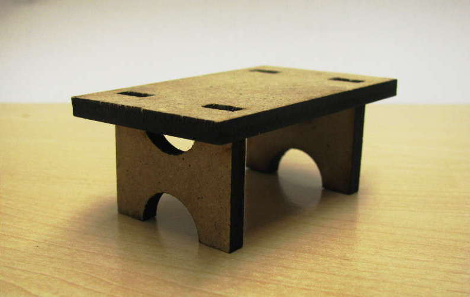
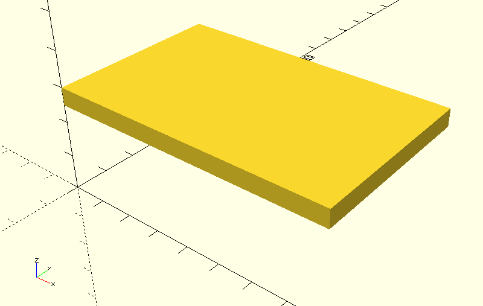
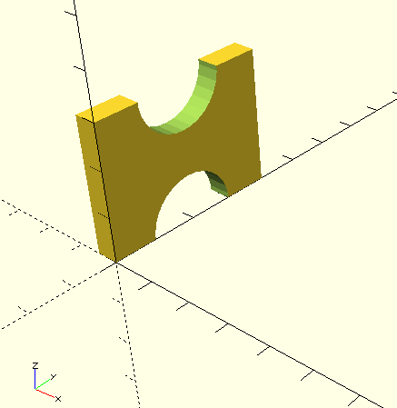
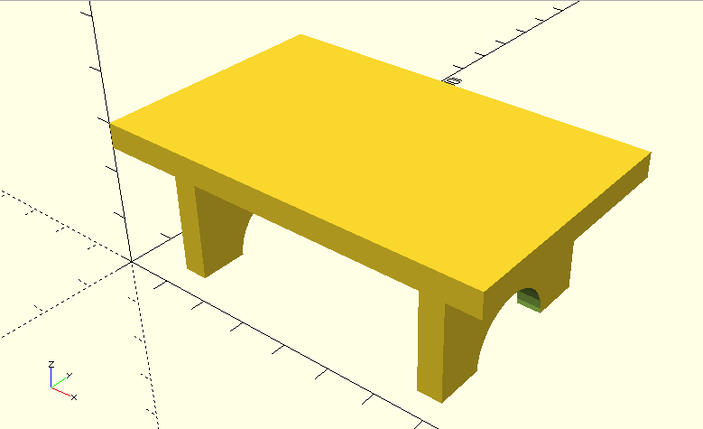

# laserscad

A library for efficient lasercutting with OpenSCAD.

## Key Features
* Laser whichever shape you want
* Model in 3D, then run one command to generate a 2D lasercutting template with all parts
* Save time, because 2D parts are arranged automatically
* *New in v0.2:* Add engravings to identify parts (or to make things look fancy)

## Installation

You will need:
* A linux-based OS
* ``openscad``, ``make``, ``python3`` installed

To set up the library:
* [Download a release](https://github.com/mbugert/laserscad/releases) and unpack it to a destination of your choice
* Move ``laserscad.scad`` from the ``dist`` folder into your [OpenSCAD library folder](https://en.wikibooks.org/wiki/OpenSCAD_User_Manual/Libraries)

## Tutorial / Code Example
The library is best explained with an example ([click here](#api) to jump to the full API reference).

Say we want to create this small table which consists of a table top and two legs:



### Creating the Model

Let's start by including laserscad and by defining some lengths and a basic table top:

```
include <laserscad.scad>

thick = 5; // 5mm thick material
top_x = 80;
top_y = 50;
leg_y = 40;
leg_z = 30;

cube([top_x, top_y, thick]);
```

We need to inform laserscad that our cube should be a lasered part. To do so, we wrap it with ``lpart()``, which takes two arguments: a unique string identifying the part and its dimensions on the x and y axes:

```
lpart("table-top", [top_x, top_y]) {
    cube([top_x, top_y, thick]);
}
```

Let's translate the table top to where it will sit in the final model. Lparts can be translated using ``ltranslate``, which basically behaves like the ordinary ``translate`` operator:

```
ltranslate([0,0,leg_z-thick]) {
	lpart("table-top", [top_x, top_y]) {
	    cube([top_x, top_y, thick]);
	}
}
```
Here's what it looks like in OpenSCAD now:



Our table will have two identically shaped legs, so let's create a module for both:

```
module leg(id) {
    lrotate([0,-90,0])
        lpart(str("table-leg-",id), [leg_z, leg_y])
            difference() {
                cube([leg_z, leg_y, thick]);
                translate([0, leg_y/2, 0]) {
                    cylinder(r=leg_y/4, h=thick);
                    translate([leg_z, 0, 0])
                        cylinder(r=leg_y/4, h=thick);
                }
            }
}
```

Note how in this code snippet, ``lpart`` can contain an arbitrarily complex shape. Also, the leg is created lying in the xy-plane and is later rotated using ``lrotate``. This is necessary because laserscad requires lparts to lie in the xy-plane for lasering.

If we instantiate a leg with ``leg("left");`` it will look like this:



What's left to do now is to instantiate and position the two legs and to modify our table top so that it features cutouts for the legs. Afterwards, the model looks like this in 3D:



The full code for the example can be found at ``example/table.scad``.

### Generating the 2D laser template

Say we saved the model to the file ``~/table.scad``. To generate the lasercutting template, we open a shell in the folder containing ``Makefile`` and run ``make model=~/table.scad``.
This creates the file ``~/table.dxf`` which contains the template for our table:


There will also be a folder ``~/_laserscad_temp`` which, once we have the DXF file, can be removed manually or by calling ``make clean model=~/table.scad``.


## API Reference / Function Overview <a name="api"></a>
This section covers modules/operators offered by laserscad and parameters related to lasering.

### Including the library
``include <laserscad.scad>``

### lpart
Defines an single object which will be lasercut, consisting of its children.
Children must be located in the first octant (in the positive x,y,z range). laserscad projects lparts on the xy-plane, i.e. lparts should be modeled as 2D objects in the xy-plane with a thickness in positive z-direction.

``lpart(id, [x, y]) { ... }``

#### Parameters
* *id*: unique identifier string
* *[x, y]*: x and y dimensions of the hull around the children

### ltranslate
Use ``ltranslate`` to translate ``lpart``s. Has the same method signature as the regular ``translate``. To move things around inside of ``lpart``, use the regular ``translate``.

### lrotate, lmirror
Similar to ``ltranslate``.

### ldummy
Children of ``ldummy`` are shown during development but are ignored when exporting to 2D. This can be useful for modeling laser-cut parts around reference objects.

### lengrave
Adds an engraving to an lpart.
``lengrave`` has to be used 

``lengrave(parent_thick, children_are_2d) { ... }``

#### Parameters
* *parent_thick*: Thickness (in z-direction) of the lpart this lengrave is applied to. Only affects the development preview.
* *children_are_2d*: Tells ``lengrave`` whether its children are a 2D object (``true``) or a 3D object (``false``).

### lslice
Children of ``lslice`` are sliced along the z-axis with a specifiable slice thickness. This creates multiple lparts at once. Children must be located in the first octant (in the positive x,y,z range).


[Low Poly Stanford Bunny by johnny6](https://www.thingiverse.com/thing:151081) is licensed under the [Creative Commons - Attribution - Non-Commercial license](https://creativecommons.org/licenses/by-nc/3.0/).

``lslice(id, [x, y], z, thickness) { ... }``

#### Parameters
* *id*: unique identifier string
* *[x, y]*: x and y dimensions of the hull around the children
* *z*: z dimension of the hull around the children
* *thickness*: slice thickness

### Parameters
These parameters can be defined in the global scope of a scad file.

#### lkerf
Compensate kerf (shrinkage caused by the laser beam) for all lparts in millimeters. *Default = 0*

#### lmargin
Distance between lparts in the 2D template in millimeters. *Default = 2*

#### lidentify
Assembling models with many similar-looking lparts can be a challenge. If the boolean ``lidentify`` parameter is set to ``true``, each lpart will be engraved with its unique id, eliminating any confusion. *Default = false*

### Exporting to 2D
This is a reference of the commands for exporting a lasercutting template or engravings.

#### Lasercutting template
1. Open a shell and ``cd`` into the directory containing the ``Makefile``.
2. Run ``make model=path/to/your/model.scad``, where the path is a relative or absolute path pointing to the OpenSCAD model you want to export. This creates a lasercutting template as a DXF file in the same folder as your model.
3. *Recommended:* Check ``_laserscad_temp/<your-model>_2d.scad`` to verify that all ``lpart`` dimensions were defined correctly and nothing overlaps. The ``_laserscad_temp`` folder is safe to delete, by the way.

#### Engravings
Replace step 2 from above with ``make engrave model=path/to/your/model.scad``. This creates an SVG file with the engravings in the same folder as your model.
To export the lasercutting file and the engravings in one go, run ``make -j 2 cut engrave model=...``.

#### Sheet Size
The default sheet size for arranging parts is 600x300 (millimeters). To export for a different size, add the parameters ``sheet_xlen=... sheet_ylen=...`` when calling ``make``.

## FAQ
### What does laserscad do?
It simplifies and accelerates the process of creating 2D laser-cut objects with OpenSCAD.

### What does laserscad not do?
It does not offer methods for creating boxes, different types of joints, and so on.
There are, however, several other OpenSCAD libraries for this purpose (like [lasercut](https://github.com/bmsleight/lasercut) or [JointSCAD](https://github.com/HopefulLlama/JointSCAD)) which work great together with laserscad.

### Meh, examples. Show me a real application.
That's not a question. Anyway, here you go: [Korg Volca Case made with laserscad](https://github.com/mbugert/volca-case)

### How does it work internally?
Several steps are performed internally. First, the library identifies all dependencies of the user's model. Then, the user's model is built with openscad. Meanwhile, laserscad echoes the ids and dimensions of every lpart, which are collected in a file. A python script reads this file and computes a position for every lpart. A second python script merges the computed positions with the user's scad file (and all its dependencies), which can then be exported.