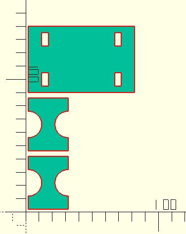

# laserscad

A library for efficient lasercutting with OpenSCAD.

## Key Features
* Laser whichever shape you want
* Model in 3D, then run one command to generate a 2D lasercutting template with all parts
* Save time and materials, because 2D parts are arranged automatically

## Installation

You will need:
* A linux-based OS
* ``openscad``, ``make``, ``python3`` installed

To set up the library:
* Download or clone the contents of this repository to a destination of your choice
* Move ``laserscad.scad`` from the ``dist`` folder into your [OpenSCAD library folder](https://en.wikibooks.org/wiki/OpenSCAD_User_Manual/Libraries)

## Tutorial / Code Example
The library is best explained with an example (scroll down if you are looking for a full API reference).

Say we want to create this small table which consists of a table top and two legs:


### Creating the Model

Let's start by including laserscad and by defining some lengths and a basic table top:

```
include <laserscad.scad>

thick = 5; // 5mm thick material
top_x = 80;
top_y = 50;
leg_y = 40;
leg_z = 30;

cube([top_x, top_y, thick]);
```

We need to inform laserscad that our cube should be a lasered part. To do so, we wrap it with ``lpart()``, which takes two arguments: a unique string identifying the part and its dimensions on the x and y axes:

```
lpart("table-top", [top_x, top_y]) {
    cube([top_x, top_y, thick]);
}
```

Let's translate the table top to where it will sit in the final model. Lparts can be translated using ``ltranslate``, which basically behaves like the ordinary ``translate`` operator:

```
ltranslate([0,0,leg_z-thick]) {
	lpart("table-top", [top_x, top_y]) {
	    cube([top_x, top_y, thick]);
	}
}
```
Here's what it looks like in OpenSCAD now:


Our table will have two identically shaped legs, so let's create a module for both:

```
module leg(id) {
    lrotate([0,-90,0])
        lpart(str("table-leg-",id), [leg_z, leg_y])
            difference() {
                cube([leg_z, leg_y, thick]);
                translate([0, leg_y/2, 0]) {
                    cylinder(r=leg_y/4, h=thick);
                    translate([leg_z, 0, 0])
                        cylinder(r=leg_y/4, h=thick);
                }
            }
}
```

Note how in this code snippet, ``lpart`` can contain an arbitrarily complex shape. Also, the leg is created lying in the xy-plane and is later rotated using ``lrotate``. This is necessary because laserscad requires lparts to lie in the xy-plane for lasering.

If we instantiate a leg with ``leg("left");`` it will look like this:


What's left to do now is to instantiate and position the two legs and to modify our table top so that it features cutouts for the legs. Afterwards, the model looks like this in 3D:


The full code for the example can be found at ``example/table.scad``.

### Generating the 2D laser template

Say we saved the model in a file called ``table.scad``. To generate the lasering template, we first move the file into the ``scad`` folder of laserscad. Then, open a shell in the folder containing ``Makefile`` and run ``make``.

As a result, the ``dxf`` folder will contain ``table.dxf``, ready for lasering:




## API Reference / Function Overview
This section covers modules/operators offered by laserscad and parameters related to lasering.

### Including the library
``include <laserscad.scad>``

### lpart
Defines its children as a part for lasering.
Children must be located in the first octant (in the positive x,y,z range). laserscad projects lparts on the xy-plane, i.e. it makes sense to model lparts as 2D objects in the xy-plane with a thickness in z-direction.

``lpart(id, [x, y]) { ... }``

#### Parameters
* *id*: unique identifier string
* *[x, y]*: x and y dimensions of the hull around the children of this lpart

### ltranslate
Use ``ltranslate`` to translate ``lpart``s. Has the same method signature as the regular ``translate``. To move things around inside of ``lpart``, the regular ``translate`` needs to be used.

### lrotate, lmirror
Similar to ``ltranslate``.

### ldummy
Children of ``ldummy`` are shown during development but are ignored when exporting to 2D. This can be useful for modeling laser-cut parts around (dummy) reference objects.

### Parameters
These parameters can be defined in the global scope of a scad file.

#### lkerf
Compensate laser kerf (shrinkage caused by the laser) in millimeters. *Default = 0*

#### lmargin
Distance between lparts in 2D in millimeters. *Default = 2*

### Exporting to 2D
1. Drag your ``.scad`` source file(s) into the ``scad`` folder.
2. Open a shell in the folder containing ``Makefile`` and run ``make``. The resulting DXF files are located in the ``dxf`` folder.
3. *Recommended:* Open ``scad/<your-model>_2d.scad`` with OpenSCAD to verify that all ``lpart`` dimensions were defined correctly and nothing overlaps.

### Sheet Size
There is currently no nice way of specifying the sheet size. However, it can be changed with a text editor in the ``Makefile``. The default is 600x300 (millimeters).

## FAQ
### What does laserscad do?
It simplifies and accelerates the process of creating 2D laser cut objects with OpenSCAD.

### What does laserscad not do?
It does not offer methods for creating boxes, different types of joints, and so on.
There are, however, several other OpenSCAD libraries for this purpose (like [lasercut](https://github.com/bmsleight/lasercut) or [JointSCAD](https://github.com/HopefulLlama/JointSCAD)) which work great together with laserscad.

### How does it work internally?
It's a three-stage process:
1. The user's model is built with openscad. Meanwhile, laserscad echoes the ids and dimensions of every lpart, which are collected in a file.
2. A python script reads this file and computes a position for every lpart.
3. A second python script merges the computed positions with the user's scad file, which can then be rendered in DXF format.
